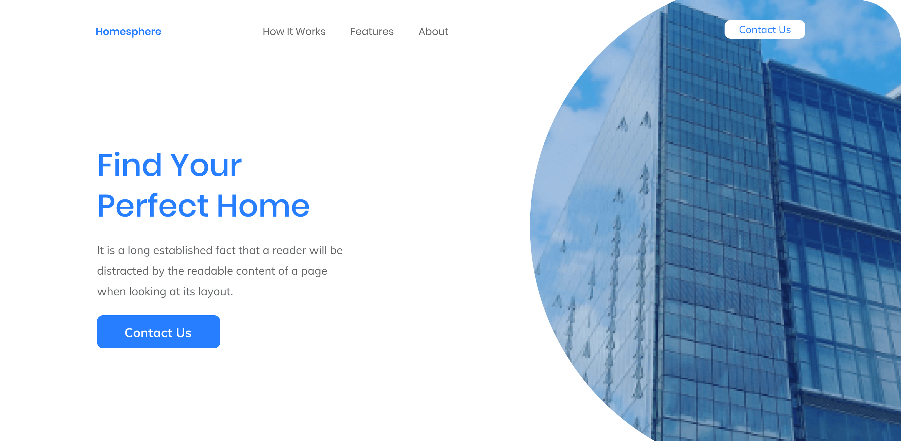

# Wordpress Recruitment Task

Hi!

Thank you for joining our recruitment process @ Clean Commit! This task will test how you can work with front end project.

## Task

We have to create a landing page for our clients using Wordpress. Can you ship it?

The design can be found in sources library in .fig in sources directory.
Our designers work mostly with Figma, but you can choose whichever you like!

## Requirements

We work with WordPress using [Bedrock](https://roots.io/bedrock/) & [Sage](https://roots.io/sage/) starting theme. Please use this resources to create a theme based on the design in Sources directory.

## Rules & Hints

1. You can use any JS framework to complete the task.
2. Use Tailwind as your framework
3. Use Blade as templating language.
4. Styles should be written in Sass (SCSS).
5. Pay attention to code quality, formatting, conventions etc. (Your code is your business card)
6. Try to optimize images :)
7. Send us access to your repo to check out your work!
