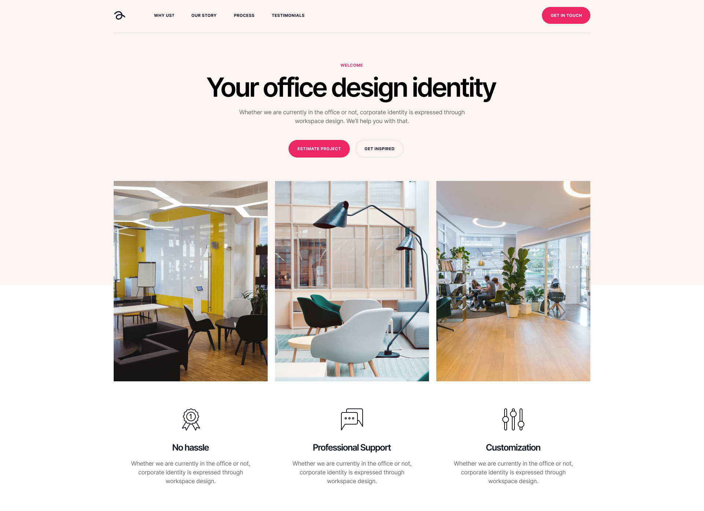

# Wordpress Recruitment Task

Hi!

Thank you for joining our recruitment process @ Clean Commit! This task will test how you can work with a fresh WordPress project.

## Task

- [] Setup local env using Laravel Homestead
- [] Create a theme for the landing page using Sage theme
- [] Prepare a hero section using ACF Flexible Content
- [] Export DB and add it to the repo
- [] Default domain for the project should be `[github-handle]-cc-lp.local`

## Description

This is a simple task for WordPress devs, all you need to do is spin up a local env using Homestead, create a new theme, and prepare one section using ACF Flexible Content (this section has to be available on every page (excluding posts)).

The design can be found in the sources library in .fig in the sources directory.

ACF plugin can be found in the `plugins` folder.

## Rules & Hints

1. You can use any JS framework to complete the task.
2. Use Tailwind as your framework
3. Use Blade as templating language.
4. Styles should be written in Sass (SCSS).
5. Pay attention to code quality, formatting, conventions, etc. (Your code is your business card)
6. Make sure images are correctly optimized
7. Send us access to your repo to check out your work!
8. Sage 9.0.10 isn't working correctly, you can use Sage 10 or 9.0.9
9. Only use ACF plugin (except mu-plugins)
10. ACF fields must be saved as a .json file in the theme
